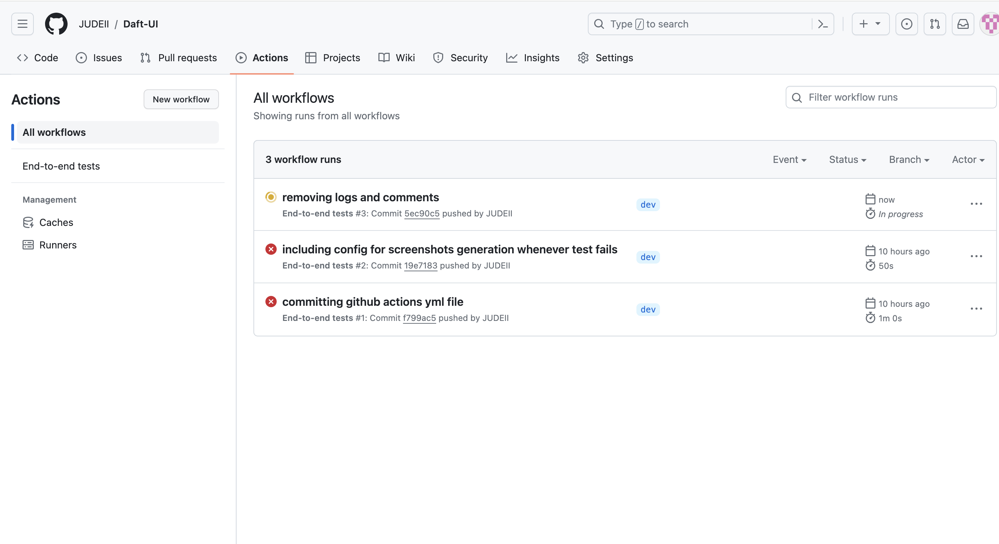
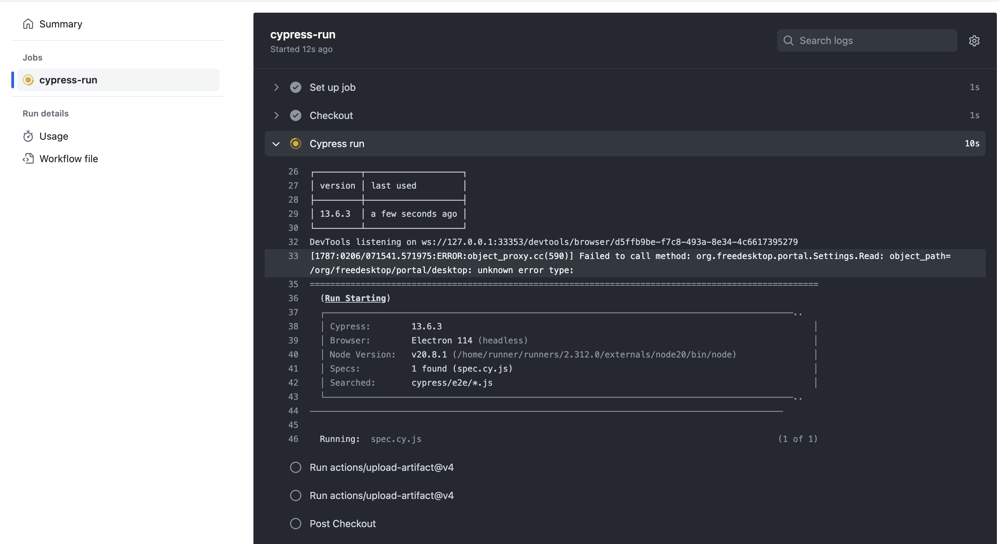

# Daft UI automation
This test automation was implemented using the cypress + javascript.
Cypress is a test automation tool for testing web applications.

## SETUP
* In order to setup this application, ensure that <code>node</code> has been installed on the local machine.
* Afterwards run the command below to initiate the package.json file
```sh
 npm -i init
```
After the package.json file has been setup, confirm that the dependency <code>cypress</code> exists in the <code>package-lock.json</code> file .

## HOW TO RUN

#### If you want to run the test in headless mode, navigate to the project root via the terminal, and type:
```sh
npx cypress run -spec cypress/e2e/spec.cy.js 
```

#### If you want to run the test in browser mode, navigate to the project root via the terminal, and type:
```sh
npx cypress open
```

### Implementation:
This automation framework follows `Page Object Model` pattern.

The spec file can be found in this path `cypress/e2e/spec.cy.js` inside the cypress package. This is the main file containing the tests.
The pageObjects package contains the files for the various pages `Homepage.js`, `PropertiesPage.js`, each of these class contains the elements and methods for various test actions.

###Screenshots
Cypress automatically creates screenshot of failed tests. They can be found in this path `cypress/screenshots/spec.cy.js`

###Custom Methods
The custom commands and methods can be found in the path `cypress/support/commands.js`

## CI/CD 
CI/CD has been setup using github actions in the repository. That way, once a push is made, the pipeline is triggered and the test suite is run automatically. 

The yml file containing the cypress configurations can be found in the path `.github/workflows/ci.yml`. It includes sets of actions to take when the test passes and when it fails (e.g screenshots).
Whenever the test fails, you will see the button to download screenshot

To view the pipeline on github, click on the `Actions` button. See screenshots of the various stages below

`job triggered`


`job running`


`job completed`


